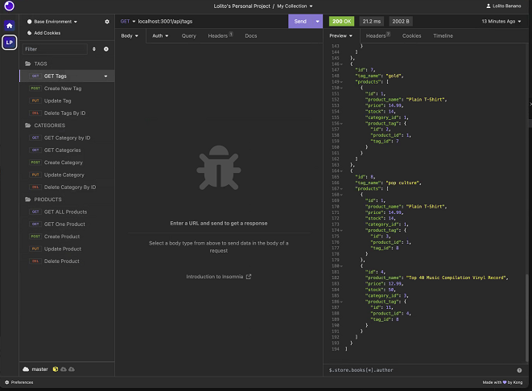
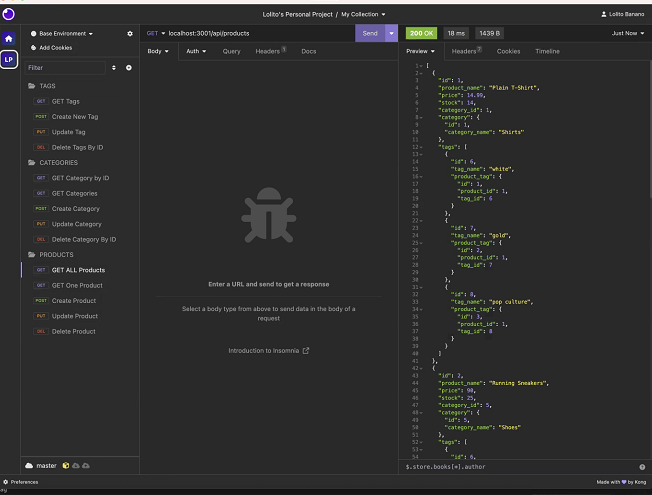
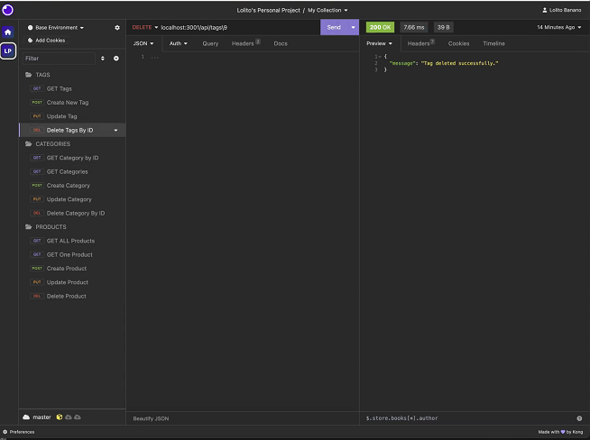

# E-Commerce Back End By Lolito

This is the README for the E-Commerce Back End project. This project involves building the back end for an e-commerce site using Express.js, Sequelize, and MySQL. Below, you'll find important information about the project, including how to set it up, use it, and credits to the owner.

## Table of Contents

- Project Description
- User Story
- Acceptance Criteria
- Mock-Ups
- Getting Started
- Database Models
- Associations
- API Routes
- Seed the Database
- Sync Sequelize
- Walkthrough Video
- Repository Link
- Owner Credits

## Project Description

Internet retail, also known as **e-commerce**, is a significant industry in the electronics sector. This project involves building the back end for an e-commerce website, using Express.js to create an API that interacts with a MySQL database through Sequelize. The project aims to provide the fundamental architecture for an e-commerce site.

## User Story

AS A manager at an internet retail company
I WANT a back end for my e-commerce website that uses the latest technologies
SO THAT my company can compete with other e-commerce companies

## Acceptance Criteria

- A functional Express.js API.
- Ability to connect to a database using Sequelize.
- Creation and seeding of a development database with test data.
- Server startup with synchronization of Sequelize models to the MySQL database.
- API GET routes for categories, products, and tags that return data in formatted JSON.
- API POST, PUT, and DELETE routes for creating, updating, and deleting data in the database.

## Mock-Ups

### Testing in Insomnia

## Getting Started

To get started with this project, follow these steps:

1. Use the MySQL2 and Sequelize packages to connect your Express.js API to a MySQL database.

2. Store sensitive data like your MySQL username, password, and database name in environment variables using dotenv.

3. Create your database with MySQL shell commands using the schema.sql file in the db folder.

## Database Models

The database should contain the following models:

- Category
  - id: Integer, primary key, auto-increment.
  - category_name: String, doesn't allow null values.

- Product
  - id: Integer, primary key, auto-increment.
  - product_name: String, doesn't allow null values.
  - price: Decimal, doesn't allow null values, validates as decimal.
  - stock: Integer, doesn't allow null values, default value of 10, validates as numeric.
  - category_id: Integer, references the Category model's id.

- Tag
  - id: Integer, primary key, auto-increment.
  - tag_name: String.

- ProductTag
  - id: Integer, primary key, auto-increment.
  - product_id: Integer, references the Product model's id.
  - tag_id: Integer, references the Tag model's id.

## Associations

- Product belongs to Category, and Category has many Product models.
- Product belongs to many Tag models, and Tag belongs to many Product models using the ProductTag through model.

## API Routes

The API routes for performing CRUD operations are found in the following files:

- product-routes.js
- tag-routes.js
- category-routes.js

The project already includes functionality for creating the many-to-many relationship for products.

## Seed the Database

After creating the models and routes, run npm run seed to seed data to your database for testing purposes.

## Sync Sequelize

In server.js, the code is provided to sync the Sequelize models to the MySQL database on server start.

## Walkthrough Video

Please refer to the walkthrough video for a demonstration of the project's functionality and how it meets the acceptance criteria.

[Walkthrough Video](https://drive.google.com/file/d/1eoTpyADva0OJfqfZj6dCLi7DU06fi5L0/view)

## Repository Link

[GitHub Repository](https://github.com/hyperlitz/LETSHOPPE)

## Owner Credits

This project was created by [Owner Name](Lolito Banano) and serves as a demonstration of their skills and expertise. Feel free to reach out to the owner for any inquiries or feedback related to this project.

---

Note: This README provides an overview of the project and its requirements. For detailed instructions and code implementation, please refer to the project repository and walkthrough video.
